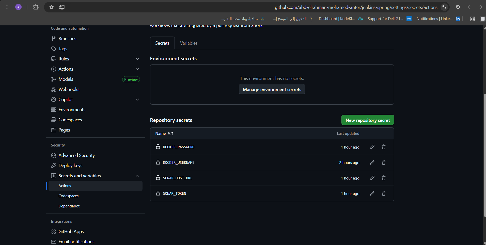
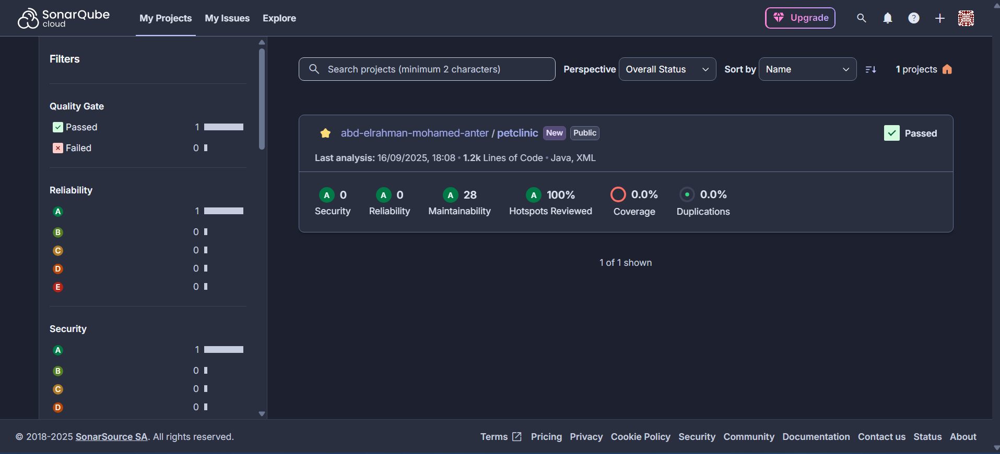
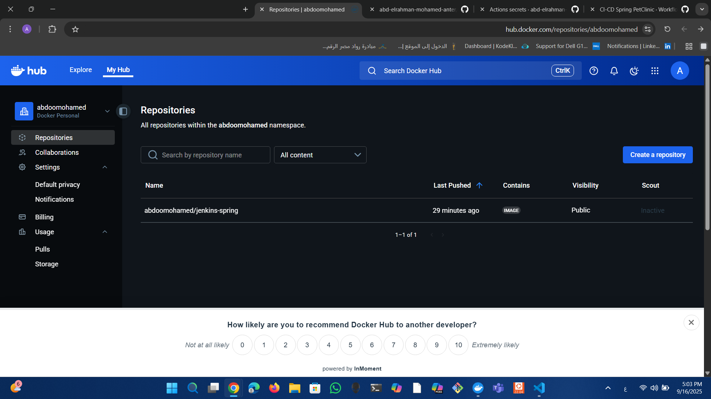

# 🚀 CI/CD Pipeline for Spring PetClinic with GitHub Actions

This repository demonstrates how to implement a **CI/CD pipeline** for a Java Spring Boot application (Spring PetClinic) using **GitHub Actions**, **SonarCloud**, and **Docker Hub**.  

The pipeline automates the process of building, analyzing, containerizing, and publishing the application with every change pushed to the repository.  

---

## 🔄 Workflow Overview

The GitHub Actions workflow is defined in:  
📂 `.github/workflows/maven.yml`

The pipeline triggers on:
- Pushes to the **`main`** branch  
- Pull requests  

It contains a single job called **`build-analyze-deploy`** which executes the following steps:

1. **Checkout Code**  
   Pulls the source code from the GitHub repository.

2. **Set up Java**  
   Installs **JDK 17 (Temurin)** to provide the required Java environment.

3. **Cache Maven Packages**  
   Speeds up build times by caching project dependencies.

4. **Build Project**  
   Compiles and packages the application using Maven.

5. **Run SonarCloud Analysis**  
   Analyzes code quality, security, and maintainability using SonarCloud.

6. **Log in to Docker Hub**  
   Authenticates with Docker Hub using GitHub repository secrets.

7. **Build Docker Image**  
   Builds a Docker image of the application.

8. **Push Docker Image**  
   Publishes the Docker image to the configured Docker Hub repository.
 

---

## 🔐 Repository Secrets

This project uses GitHub Actions to automate CI/CD. To securely connect with external services, the following **repository secrets** are configured:

| Name              | Description |
|------------------|-------------|
| `DOCKER_USERNAME` | Docker Hub username |
| `DOCKER_PASSWORD` | Docker Hub access token with read & write permissions |
| `SONAR_TOKEN`     | SonarCloud token used to authenticate and analyze the project |
| `SONAR_HOST_URL`  | URL of the SonarCloud server (`https://sonarcloud.io`) |

> **Note:** Secrets are stored in GitHub repository settings under **Settings → Secrets and variables → Actions** and are **not visible in the repository or logs**.
### screen shot 

---

## 📷 Screenshots

### 1️⃣ GitHub Actions Workflow  
Successful runs of the CI/CD pipeline:  


---

### 2️⃣ Workflow Job Details  
Each step of the job (`build-analyze-deploy`) runs successfully:  


---

### 4️⃣ SonarCloud Analysis Results  
The project passed the **Quality Gate** with ratings:    

| Metric               | Value  | Rating |
|---------------------|-------|--------|
| Security             | 0     | A      |
| Reliability          | 0     | A      |
| Maintainability      | 28    | A      |
| Hotspots Reviewed    | 100%  | A      |
| Duplications         | 0.0%  | A      |

**Explanation of Metrics:**

- **Security (0 – A):** No known security vulnerabilities detected. The code is safe from common security risks.  
- **Reliability (0 – A):** The code is stable with no issues that could cause runtime failures.  
- **Maintainability (28 – A):** The code is easy to maintain and extend, with only minor potential improvements.  
- **Hotspots Reviewed (100% – A):** All critical code areas have been reviewed, ensuring risk areas are addressed.  
- **Coverage (0.0% – Needs Improvement):** No unit tests have been executed yet. Adding tests will improve code coverage and confidence.  
- **Duplications (0.0% – A):** No duplicated code found, which keeps the codebase clean and maintainable.

  


---

### 5️⃣ Docker Hub Repository  
The Docker image was successfully pushed to Docker Hub:  

👉 [`abdoomohamed/jenkins-spring`](https://hub.docker.com/repository/docker/abdoomohamed/jenkins-spring)  



---

## 📊 Results

- **Automated CI/CD** runs on every push or PR.  
- **Code quality** continuously monitored via SonarCloud.  
- **Docker images** automatically built and published to Docker Hub.  

---

## ✅ Conclusion

With this setup:
- Code is built, analyzed, and containerized automatically.  
- Developers get instant feedback on quality and security.  
- Docker images are always available for deployment.  

---

## 🐳 Run the Docker Image

To pull and run the image locally:  

```bash
# Pull the image from Docker Hub
docker pull abdoomohamed/jenkins-spring:latest

# Run the container
docker run -p 8080:8080 abdoomohamed/jenkins-spring:latest

