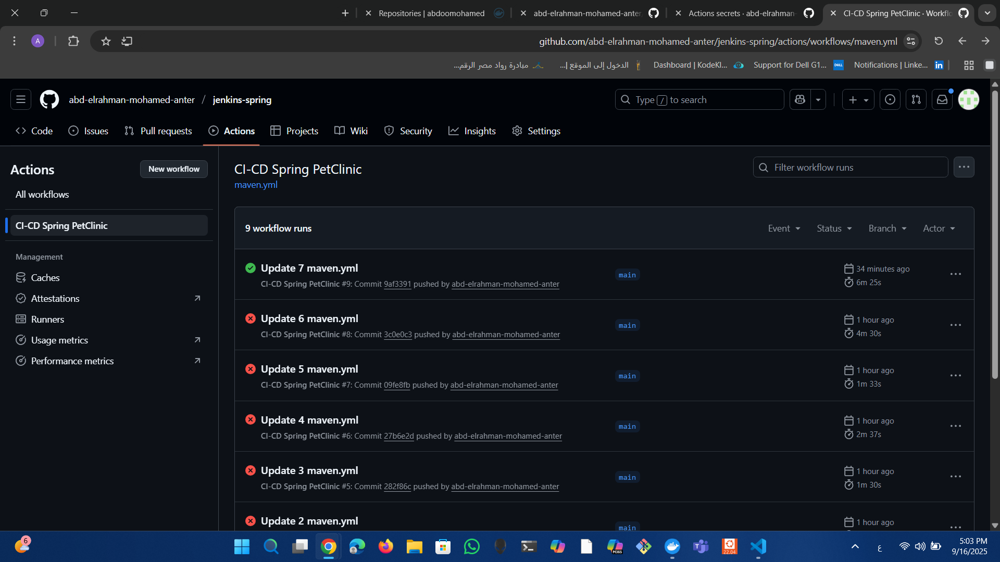
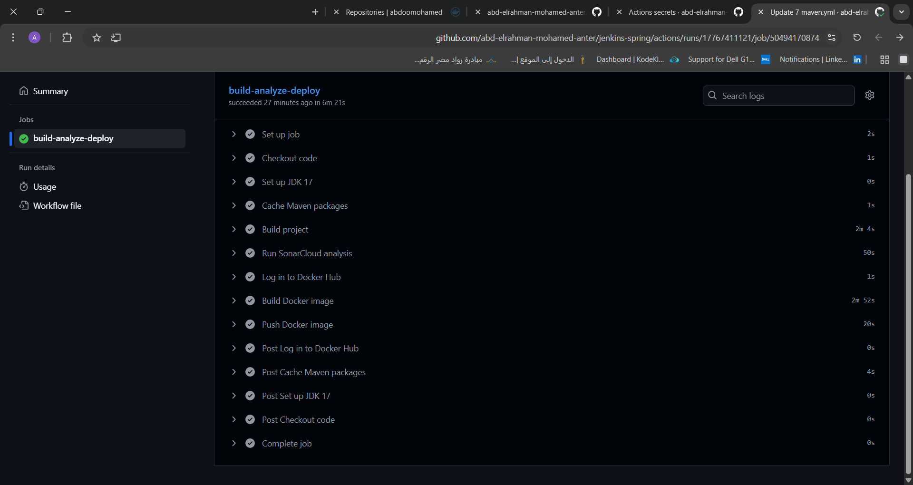
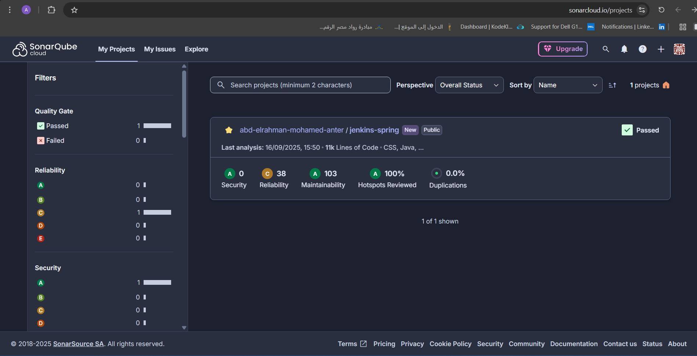

# 🚀 CI/CD Pipeline for Spring PetClinic with GitHub Actions

This repository demonstrates how to implement a **CI/CD pipeline** for a Java Spring Boot application (Spring PetClinic) using **GitHub Actions**, **SonarCloud**, and **Docker Hub**.  

The pipeline automates the process of building, analyzing, containerizing, and publishing the application with every change pushed to the repository.  

---

## 🔄 Workflow Overview

The GitHub Actions workflow is defined in:  
📂 `.github/workflows/maven.yml`

The pipeline triggers on:
- Pushes to the **`main`** branch  
- Pull requests  

It contains a job `build-analyze-deploy` that performs the following steps:  

1. **Checkout Code** → Pulls the source code from GitHub.  
2. **Set up Java** → Installs JDK 17 (Temurin).  
3. **Cache Maven Packages** → Speeds up builds by caching dependencies.  
4. **Build Project** → Compiles and packages the application.  
5. **Run SonarCloud Analysis** → Checks code quality and security.  
6. **Log in to Docker Hub** → Authenticates using GitHub Secrets.  
7. **Build Docker Image** → Builds the app image with Docker.  
8. **Push Docker Image** → Publishes the image to Docker Hub.  

---

## 📷 Screenshots

### 1️⃣ GitHub Actions Workflow  
Successful runs of the CI/CD pipeline:  



---

### 2️⃣ Workflow Job Details  
Each step of the job (`build-analyze-deploy`) runs successfully:  



---

### 4️⃣ SonarCloud Analysis Results  
The project passed the **Quality Gate** with ratings:    
- Quality Metrics Security: 0 **A** 
-  Reliability: 38 **C** 
-  Maintainability: 103 **A** 
-  Hotspots Reviewed: 100% **A** 



---

### 5️⃣ Docker Hub Repository  
The Docker image was successfully pushed to Docker Hub:  

👉 [`abdoomohamed/jenkins-spring`](https://hub.docker.com/repository/docker/abdoomohamed/jenkins-spring)  


---

## 📊 Results

- **Automated CI/CD** runs on every push or PR.  
- **Code quality** continuously monitored via SonarCloud.  
- **Docker images** automatically built and published to Docker Hub.  

---

## ✅ Conclusion

With this setup:
- Code is built, analyzed, and containerized automatically.  
- Developers get instant feedback on quality and security.  
- Docker images are always available for deployment.  

---

## 🔮 Next Steps (Optional Enhancements)

- Add automated unit and integration tests.  
- Deploy the Docker image automatically to Kubernetes, AWS, or another cloud provider.  

---

## 🐳 Run the Docker Image

To pull and run the image locally:  

```bash
# Pull the image from Docker Hub
docker pull abdoomohamed/jenkins-spring:latest

# Run the container
docker run -p 8080:8080 abdoomohamed/jenkins-spring:latest
```
## 📚 References
- [SonarCloud Docs](https://docs.sonarcloud.io/)
- [GitHub Actions Docs](https://docs.github.com/en/actions)
- [Docker Hub Docs](https://docs.docker.com/docker-hub/)


